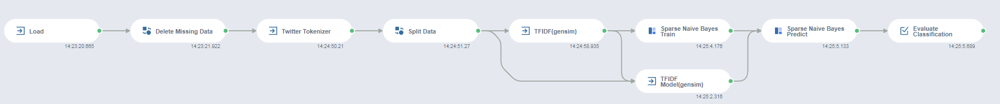
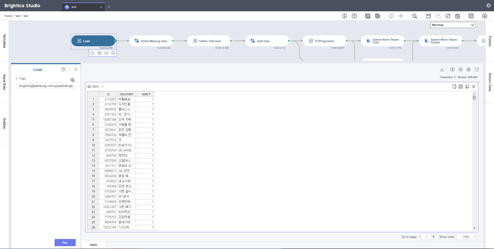
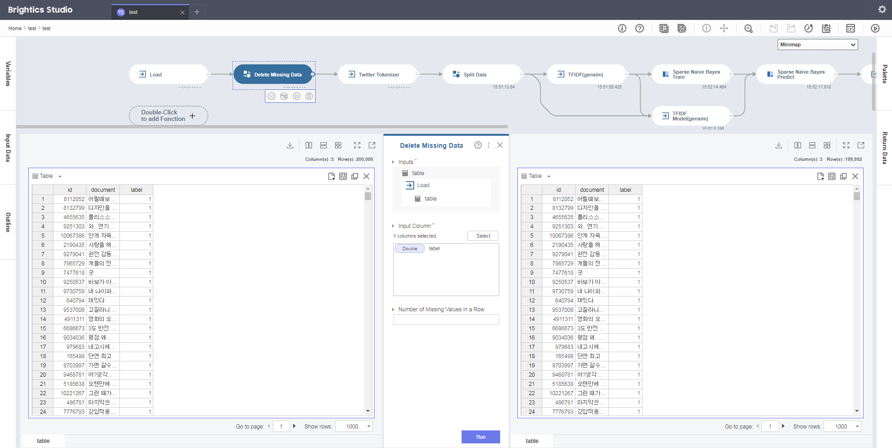

# TF-IDF 분석 및 Naive Bayes 분류
## - 영화 리뷰에 대한 선호도 분류

---

## 분석배경
### 시나리오
 - 
 - 

### 목표

- 

- .

---

## Brightics 프로세스

 

### Data Load
- 영화 리뷰 데이터를 Load한다.  (<a href="./data/ratings.txt" download>ratings.txt</a>)

- Columns
	- id(Double) : 고유한 id
	- document(String) : 영화 리뷰
	- label(Double) : 평가(0: 부정, 1: 긍정)
  
  
	| id |   document   | label |
	|:------------:|:--------:|:----:|
	| 1221815 | 인디아나존스와 같은 모험과 스릴이 있는 오락영화 |  1  |
	| 5945035 | 이렇게 재미없는 영화는 처음이다 |  0  |
	| 9375903 | 이거 영화 왜 만들었는지 몰겠다. |  0  |
	| 5372243 | 색다른 발상 ㅋㅋ 그리고 꽤 재미있었음 |  1  |
	| 6679540 | no 잼(10자 채우기) |  0  |
	| 5923536 | 로그인해서 평점남기는게 전혀 귀찮지 않은 영화. ^^ |  1  |
 

### Pre-processing
- 모델을 생성하기 전에 잘못된 데이터를 제거한다.
- 영화 리뷰들을 형태소 별로 분리한다.
- Train/Test 데이터로 분리한다. 변경 방법은 아래와 같다.

#### Delete Missing Data  

- Naive Bayes 모델에 적용하기 위해, label 값이 None인 데이터를 제거한다. 

- Parameter
	- Columns : label
	

 

#### Twitter Tokenizer  

- TF-IDF를 계산하기 위해서는 영화 리뷰 데이터들을 형태소 별로 분리해야 한다.
- Stemming과 Text Normalization을 사용하고 모든 형태소가 출력되도록 Morphemes를 모두 선택해준다.

- Parameter
	- Column : document
	- Stemming : True
	- Text Normalization : True
	- Morphemes : Select All

 

#### Split Data  
- Train 70%, Predict 30%로 설정하여 데이터를 분할 구성하고, 모델의 재현성을 위하여 Seed는 123으로 입력한다.

- Parameter
	- Ratio : 7, 3
	- Seed : 123

 

---

## Comment

-  분석 결과 하은이는 상품을 총 6가지 군집으로 분류하였으며, 각 군집 별 팔리는 시간대의 특징을 분석하여 마케팅을 진행하기로 하였다.

---

## Data & Model 다운로드

### 입력 데이터
- <a href="s1.0/tutorial-resources/input/28_py_market_saledata_clustering.csv" download>28_py_market_saledata_clustering.csv</a>

### 참고 모델 
- <a href="s1.0/tutorial-resources/model/28_py_market_saledata_clustering.json" download>28_py_market_saledata_clustering.json</a>

---

 **#K-means** **#Pivot** **#Scale** **#Scree plot** **#SSE** **#Retail**  **#Clustering** **#Silhouette**

---
