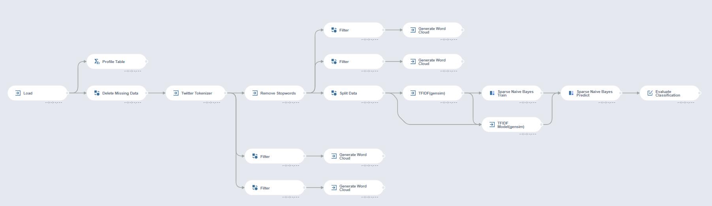
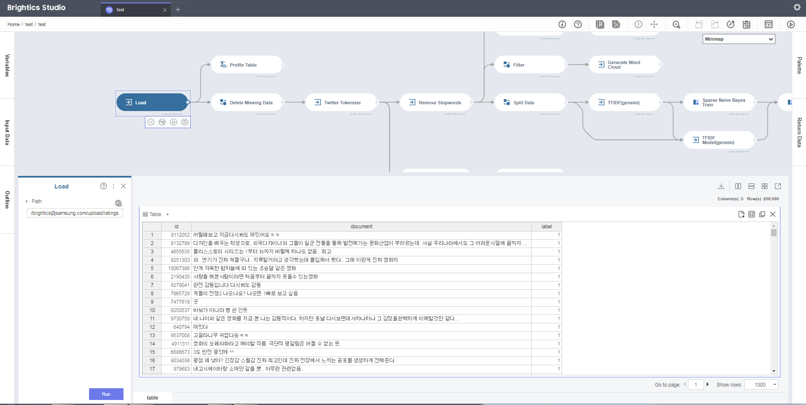
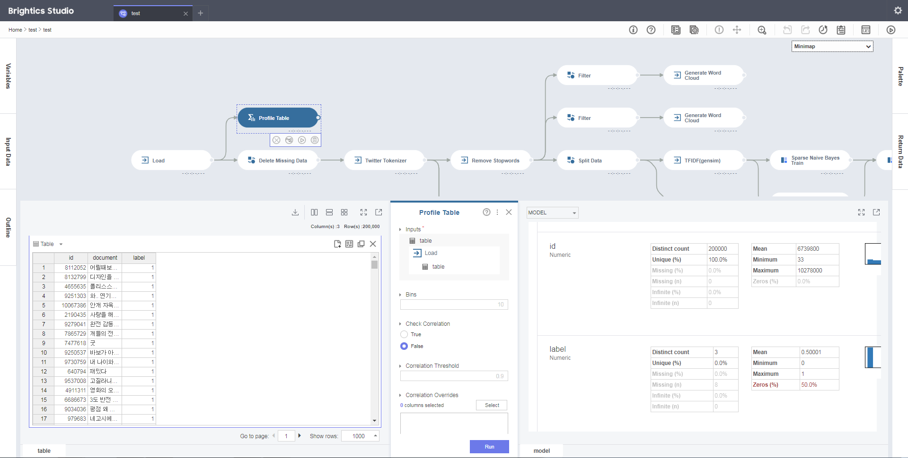
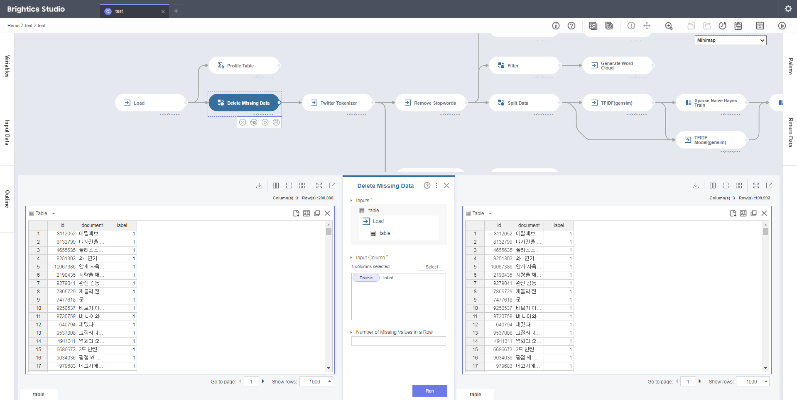

# TF-IDF를 이용한 감성 분류
## - 영화 리뷰에 대한 선호도 분류

---

## 분석배경
### 시나리오

 - 영화 마케팅 담당자인 상순이는 영화 첫 개봉일 관객 반응에 따라 마케팅 강도를 조절하려고 한다. 반응을 살펴보기 위해 SNS에서 관객들의 영화 리뷰를 수집하였다.

- 분류할 때 사람의 힘에 의존할 경우, 객관적이지 못하고 시간이 오래 걸리기 때문에 선호도를 예측할 수 있는 분류기를 활용하고자 한다.

### 목표

- Twitter Tokenizer 함수를 이용해 영화 리뷰 데이터들을 형태소 별로 분리한다.

- 단어의 공통적인 부분으로 단어들을 통일시키기 위해 Stemming과 Text Normalization을 사용한다.

- 특정 품사의 형태소가 출력되도록 Morphemes 일부만 선택한다.

- Generate Word Cloud 함수를 통해 긍정적인 리뷰와 부정적인 리뷰에 주로 나타나는 단어들을 비교한다.

- Remove Stopwords 함수를 이용하여, 두 리뷰에 공통적으로 나타나는 단어를 제거한다.

- TFIDF(gensim) 함수를 이용하여, 영화 리뷰의 TF-IDF 값을 계산한다.

- Sparse Naive Bayes 함수를 이용하여, TF-IDF 값들을 이용한 나이브 베이즈 분류 및 예측을 수행한다.

- Evaulation을 통해 모델 성능 지표인 F-score, Accuarcy 등을 확인한다.

---

## Brightics 프로세스

 

### 1. Data Load
- 영화 리뷰 데이터를 Load한다.  (<a href="./data/ratings.txt" download>ratings.txt</a>)

- Columns
	- id(Double) : 고유한 id

	- document(String) : 영화 리뷰

	- label(Double) : 평가(0 : 부정, 1 : 긍정)
  
  
	| id |   document   | label |
	|:------------:|:--------:|:----:|
	| 1221815 | 인디아나존스와 같은 모험과 스릴이 있는 오락영화 |  1  |
	| 5945035 | 이렇게 재미없는 영화는 처음이다 |  0  |
	| 9375903 | 이거 영화 왜 만들었는지 몰겠다. |  0  |
	| 5372243 | 색다른 발상 ㅋㅋ 그리고 꽤 재미있었음 |  1  |
	| 6679540 | no 잼(10자 채우기) |  0  |
	| 5923536 | 로그인해서 평점남기는게 전혀 귀찮지 않은 영화. ^^ |  1  |
 

### 2. Pre-processing
- 모델을 생성하기 전에 잘못된 데이터를 제거한다.

- 영화 리뷰들을 형태소 별로 분리한다.

- Word Cloud를 사용하여 긍정적인 리뷰와 부정적인 리뷰에 나타나는 단어를 파악한다.

- 긍·부정 리뷰들에 공통되는 단어들을 제거한다.

- Train/Test 데이터로 분리한다. 변경 방법은 아래와 같다.

#### Profile Table  

- 데이터에 이상이 없는지 파악한다.

- Parameter
	- Table : Load - table
	- Check Correlation : False

- 분석 결과 label에서 8개의 Missing Data가 나타나는 것을 확인할 수 있다.

 

#### Delete Missing Data  

- Naive Bayes 모델에 적용하기 위해, label의 Missing data들을 제거한다. 

- Parameter
	- Columns : label
	

 

#### Twitter Tokenizer  

- TF-IDF를 계산하기 위해서는 영화 리뷰 데이터들을 형태소 별로 분리해야 한다.

- 단어의 공통적인 부분으로 단어들을 통일시키기 위해 Stemming과 Text Normalization을 사용한다.

- 리뷰를 분류하는데 큰 영향을 미치지 않을 조사, 어미, 접미사 등의 품사를 가진 형태소를 Mophemes에서 제외시킨다.

- Parameter
	- Column : document
	- Stemming : True
	- Text Normalization : True
	- Morphemes : Noun, Verb, Adjective, Foreign, Alpha, Number, Unknown, KoreanParticle

 

#### Filter  
- 긍정적인 리뷰와 부정적인 리뷰들은 어떤 단어들로 구성되어 있는지 Word Cloud를 통해 비교 해본다.

- 긍정적인 리뷰와 부정적인 리뷰를 분리한다.

- parameter
	- Condition : label == 0

 

- parameter
	- Condition : label == 1

 

#### Generate Word Cloud 

- Tokenizer를 통해 분리된 token들을 이용하여 Word Cloud를 생성한다.

- 긍정적인 리뷰와 부정적인 리뷰들은 어떤 단어들로 구성되어 있는지 확인한다.

- parameter
	- Table : Filter (label == 0) - out table
	- Input Column : tokens
	- Width : 640
	- Height : 300

 

- parameter
	- Table : Filter (label == 1) - out table
	- Input Column : tokens
	- Width : 640
	- Height : 300

 

- 비교 결과 "영화, 하다, 보다, 되다"와 같은 긍·부정 리뷰 둘 다에서 나올 수 있는 공통적인 단어 때문에 긍·부정 리뷰의 단어적 특성이 뚜렷하게 보여지지 않는다.

#### Remove Stopwords  

- 긍·부정 리뷰들에 공통적으로 나오는 단어들을 제거한다.

- 기존의 tokens 데이터가 stopwords가 제거된 값으로 변경되도록 Output Column Name을 tokens로 설정한다.

- parameter
	- Column : tokens
	- Stopwords : 영화, 하다, 보다, 되다, 너무, 진짜, 이다, 있다
	- Output Column Name : tokens

 

#### Filter  

- 긍·부정 리뷰들에 공통적으로 나오는 단어들을 제거하여 긍·부정 리뷰들이 뚜렷한 단어적 특성이 보이는지를 확인한다.

- 긍정적인 리뷰와 부정적인 리뷰를 분리한다.

- parameter
	- Condition : label == 0

 

- parameter
	- Condition : label == 1

 

#### Generate Word Cloud 

- 긍정적인 리뷰와 부정적인 리뷰들의 구성 단어를 확인한다.

- parameter
	- Table : Filter (label == 0) - out table
	- Input Column : tokens
	- Width : 640
	- Height : 300

 

- parameter
	- Table : Filter (label == 1) - out table
	- Input Column : tokens
	- Width : 640
	- Height : 300

 

- 비교 결과 부정적인 리뷰에는 "없다, 아니다, 아깝다"와 같은 부정적인 단어들이 주로 나타났고, 긍정적인 리뷰에는 "좋다, 재밌다, 최고"와 같은 긍정적인 단어가 주로 나타나는 것을 확인할 수 있다.

#### Split Data  
- 영화 리뷰 데이터를 모델의 학습, 검증 데이터로 분리하기 위해 Train 70%, Test 30%로 설정하여 데이터를 분할 구성하고, 모델의 재현성을 위하여 Seed는 123으로 입력한다.

- Parameter
	- Ratio : 7 : 3
	- Seed : 123

 

### 3. Modeling

#### TFIDF(gensim)  

- Train 데이터에서 Tokenizer를 통해 분리된 token들을 이용하여, 문서에 있는 단어들의 TF-IDF 값을 계산하는 단계이다.

- TF-IDF 계산을 위한 설정들은 기본값으로 설정하였다.

- 출력되는 값은 sparse vectors는 size, indices, values로 구성된다.

	- size는 train 데이터의 총 단어 수를 의미한다.

	- indices는 TF-IDF가 0이 아닌 단어 index를 의미한다.

	- values는 index에 해당하는 단어들의 TF-IDF 값들을 나타낸다.

- parameter
	- Table : Split Data - train table
	- Column : tokens
	- Term Frequency Weighing : Natural
	- Document Frequency Weighting : IDF
	- Document Normalization : Cosine

 

- Dictionary를 통해 단어들의 index, IDF 등의 정보를 얻을 수 있다.

 

#### TFIDF Model(gensim)  

- TFIDF(gensim)과 연결하여 test 데이터의 TF-IDF를 계산한다.

- TFIDF(gensim)에서 정의된 단어 사전을 이용하여 train 데이터와 동일한 단어로 test 데이터의 TF-IDF 값을 계산한다.

- parameter
	- Table : Split Data - test table
	- Model : TFIDF(gensim) - model

 

#### Spare Naive Bayes Train  

- 설명변수(sparse vectors) 와 종속변수(label) 등을 선택 후, 분석을 실행한다.

- train 데이터를 이용하여 예측하고, 실제 값과 비교한 결과 약 86.9%의 정확도를 보였다.

- parameter
	- Input Column : sparse vectors
	- Label Column : label
	- Fit Class Prior Probabilities : True

 

#### Spare Naive Bayes Predict  

- 학습된 모델인 Sparse Naive Bayes Train과 test 데이터인 TFIDF Model(gensim)을 연결한다.
- 학습된 모델로 test 데이터의 label 값을 예측한다.

- parameter
	- Table : TFIDF Model(gensim) - out table
	- Model : Sparse Naive Bayes Train - model
	- Display Log Probability : False
	- Suffix Type : Index

 

### 4. Evaluation
#### Evaluate Classification  

- Sparse Naive Bayes Predict의 분류에 대한 평가를 수행한다.

- parameter
	- Label Column : label
	- Prediction Column : prediction

- 분류 성능은 Accuracy가 약 83%로 나타나는 것을 확인할 수 있다.

 

---

## Comment

- 검증 결과 약 83%의 정확도로 영화 리뷰를 통해 긍정, 부정 의견을 분류하였다.

- 영화 마케팅 담당자인 상순이는 학습된 분류기를 이용하여, 영화의 SNS 리뷰들을 보고 영화의 선호도를 파악할 수 있을 것이고, 그에 따라 마케팅 세기를 조절할 것이다.

---

## Data & Model 다운로드

### 입력 데이터
- <a href="./data/ratings.txt" download>ratings.txt</a>

### 참고 모델 
- <a href="./model/movie_review_classfication.json" download>movie_review_classfication.json</a>

---

**#Tokenizer** **#Word Cloud** **#Twitter Tokenizer** **#TF-IDF** **#Sparse** **#Sparse Vectors** **#Naive** **#Bayes** **#Naive Bayes** **#Classification** **#영화 리뷰 분류** **#감성 분류**

---
